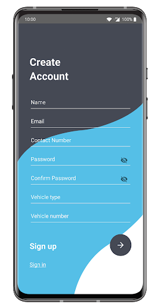
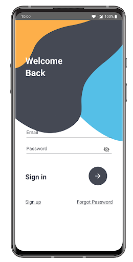
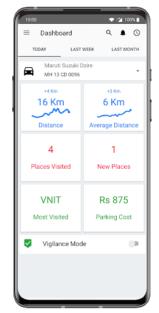
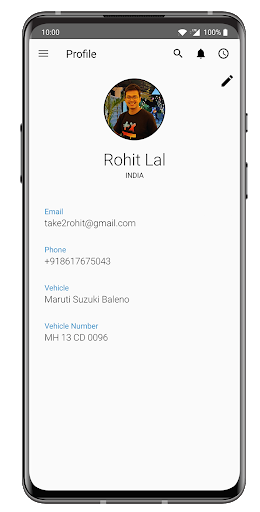
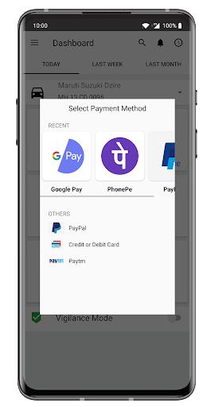
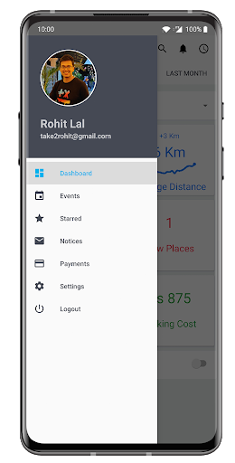
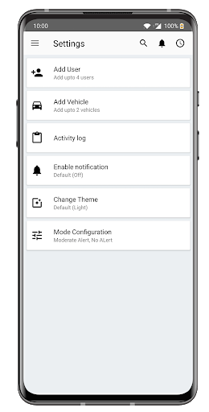
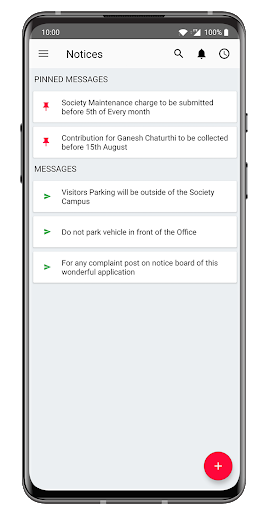

# Falcon Vision Android App

  

This is the implementation of the android app for Smart India Hackathon (Software Edition 2020). The [problem statement](https://sih2020.sih.gov.in/nodal-centers/prin-l-n-welingkar-institute-of-management-development-research-weschool/) demands the automation of number plate detection, identification and monitoring in different scenarios.

**Real time Implementation**: [Google Drive](https://drive.google.com/file/d/1v1akjvle2rp9KxP0MkASVxgWkcBIhED2/view?usp=sharing)

#### Technology Stack

* Android Studio
* Firebase
* Google Services

## Salient Features

### Registration Portal

 

An interactive registration portal, so the user can register his/he vehicle and link with the email - id. The user is required to input the vehicle model, registration plate number as well as the date of purchase. A small image database is also maintained for a car as proof as well as can be used as a dataset.

### Dashboard

 

We have an interactive dashboard, displaying the overall statistics of the user's car, involving places visited, new places, places visited as well as the total parking cost made by the user. There is an option of vigilance mode, which activates notification on the user's app in case of any activity (known or unknown). The upper right clock indicates the activity log.

### Quick Registration and Payment

We provide an easy and quick solution, for registration of the car to the society's database, by just scanning the QR code.

In case of payment at the entry, the user can use Unified Payments Interface (UPI) for quick payment of a toll, parking fee, etc.

### Adding Another Vehicle

 

One user can also register more than one vehicle if he/she possesses.

### Society Notices 

There is an option to check any important notices added by society.

### Mode Configuration

The user can set alert priority for their vehicles, such as a moderate alert for only important notifications or no alert in case he/she do not want to be disturbed.

